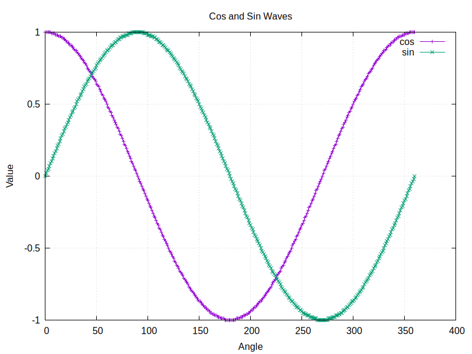
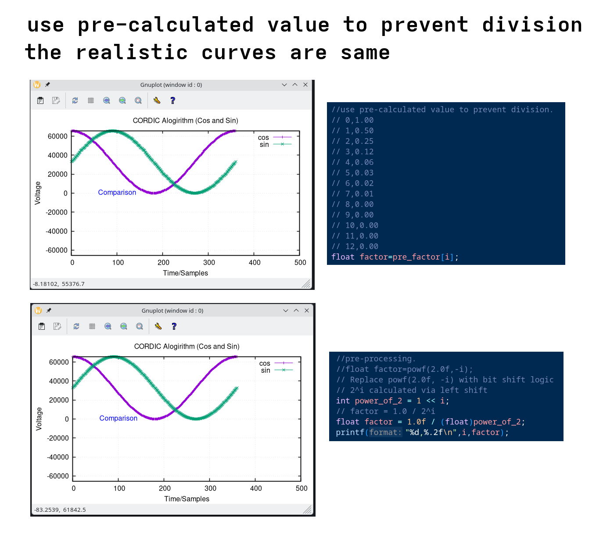

# CORDIC_Algorithm
CORDIC Algorithm Verification using C code

1.first compile the program 
    gcc cordic_test.c -lm 

2.run it to get cos and sin raw data
    ./a.out

3.check raw data file
    cat cos0_360.dat sin0_360.dat

4.plot curve to check the result
    ./gnuplot 

# use pre-calculated value to prevent division
Compare two approaches of calculate factor, the result are same.
this is useful for implementing in FPGA design. 

